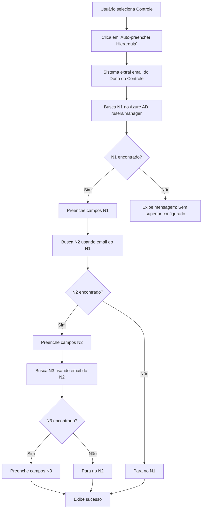

# 🔄 Preenchimento Automático de Hierarquia de Escalonamento

## 📋 Visão Geral

Funcionalidade que preenche automaticamente os níveis de escalonamento (N1, N2, N3) baseando-se na hierarquia organizacional do Azure AD (EntraID), a partir do dono do controle.

---

## 🎯 Objetivo

Simplificar a configuração de escalonamentos de controles, utilizando a estrutura hierárquica da empresa já cadastrada no Azure AD, evitando digitação manual e erros.

---

## 🔍 Como Funciona

### Regra de Preenchimento

1. **N1 (Nível 1):** Superior imediato do **Dono do Controle**
2. **N2 (Nível 2):** Superior imediato do **N1**
3. **N3 (Nível 3):** Superior imediato do **N2**

### Fluxo de Execução



---

## 🛠️ Implementação Técnica

### 1. API Route: `/api/users/manager`

**Arquivo:** `src/app/api/users/manager/route.ts`

**Funcionalidade:**
- Recebe um email como parâmetro (`?email=usuario@dominio.com`)
- Autentica no Microsoft Graph API usando ClientSecretCredential
- Busca o usuário no Azure AD pelo email
- Retorna o gerente (manager) configurado no Azure AD

**Resposta de Sucesso:**
```json
{
  "id": "abc-123-def",
  "name": "Maria Silva",
  "email": "maria.silva@empresa.com",
  "jobTitle": "Gerente de Operações",
  "department": "Operações"
}
```

**Resposta sem Gerente:**
```json
{
  "manager": null
}
```

**Endpoint Microsoft Graph Utilizado:**
```
GET /users/{userId}/manager
```

**Permissões Necessárias:**
- `User.Read.All` (Application)
- `Directory.Read.All` (Application)

---

### 2. Componente: Escalation Capture Page

**Arquivo:** `src/app/(app)/escalation/capture/page.tsx`

**Novas Funcionalidades:**

#### a) Estado para Loading
```typescript
const [loadingHierarchy, setLoadingHierarchy] = useState(false);
```

#### b) Função `handleAutoFillHierarchy`

**Responsabilidades:**
1. Valida se um controle foi selecionado
2. Extrai o email do dono do controle (formato: "Nome (email@dominio.com)")
3. Busca N1 chamando `/api/users/manager?email={donoEmail}`
4. Preenche campos de supervisor e email para N1 (ambas as configurações: % e dias)
5. Busca N2 usando o email do N1
6. Preenche campos de N2 se encontrado
7. Busca N3 usando o email do N2
8. Preenche campos de N3 se encontrado
9. Exibe toast de sucesso ou erro

**Código Simplificado:**
```typescript
const handleAutoFillHierarchy = async () => {
  // 1. Valida controle selecionado
  if (!selectedControlId) return;
  
  const control = controls.find(c => c.id === selectedControlId);
  const ownerEmail = extractEmail(control.emailDono);
  
  // 2. Busca N1
  const n1Response = await fetch(`/api/users/manager?email=${ownerEmail}`);
  const n1Data = await n1Response.json();
  
  // 3. Preenche N1
  setPctLevel1({...prev, supervisor: n1Data.name, supervisorEmail: n1Data.email});
  setDaysLevel1({...prev, supervisor: n1Data.name, supervisorEmail: n1Data.email});
  
  // 4. Busca N2 usando N1
  const n2Response = await fetch(`/api/users/manager?email=${n1Data.email}`);
  // ... continua a cadeia
};
```

#### c) Botão de Auto-Preenchimento

**Localização:** Logo ao lado do campo "Controle"

**Características:**
- Desabilitado se nenhum controle selecionado
- Mostra loading spinner durante busca
- Ícone: `Wand2` (varinha mágica)
- Texto: "Auto-preencher Hierarquia"

**Código:**
```tsx
<Button
  type="button"
  variant="outline"
  onClick={handleAutoFillHierarchy}
  disabled={!selectedControlId || loadingHierarchy}
>
  {loadingHierarchy ? (
    <><Loader2 className="animate-spin" /> Buscando...</>
  ) : (
    <><Wand2 /> Auto-preencher Hierarquia</>
  )}
</Button>
```

#### d) Indicadores Visuais

**Badges nos Níveis:**
- **N1:** "Superior imediato do dono"
- **N2:** "Superior do N1"
- **N3:** "Superior do N2"

**Highlight nos Campos Preenchidos:**
- Campos com dados: `bg-green-50 dark:bg-green-950/20`
- Indica visualmente quais campos foram preenchidos automaticamente

---

## 📸 Interface do Usuário

### Antes do Preenchimento
```
┌──────────────────────────────────────────────────┐
│ Controle *                [Auto-preencher...] 🪄 │
│ ┌────────────────────────────────────────────┐   │
│ │ [CTRL-001] Controle de Backup             │▼  │
│ └────────────────────────────────────────────┘   │
│                                                   │
│ 💡 Clique em "Auto-preencher Hierarquia" para   │
│    buscar automaticamente os supervisores...     │
└──────────────────────────────────────────────────┘

Nível 1
┌─────────┬──────────────┬──────────────────┐
│ % Meta  │ Superior N1  │ E-mail N1        │
│ [ 10 ]  │ [         ]  │ [             ]  │
└─────────┴──────────────┴──────────────────┘
```

### Depois do Preenchimento
```
┌──────────────────────────────────────────────────┐
│ Controle *                [Auto-preencher...] 🪄 │
│ ┌────────────────────────────────────────────┐   │
│ │ [CTRL-001] Controle de Backup             │▼  │
│ └────────────────────────────────────────────┘   │
└──────────────────────────────────────────────────┘

Nível 1 [Superior imediato do dono]
┌─────────┬──────────────────────────┬─────────────────────┐
│ % Meta  │ Superior N1              │ E-mail N1           │
│ [ 10 ]  │ [Maria Silva (mar...)] ✅│ [maria@...] ✅      │
└─────────┴──────────────────────────┴─────────────────────┘

Nível 2 [Superior do N1]
┌─────────┬──────────────────────────┬─────────────────────┐
│ % Meta  │ Superior N2              │ E-mail N2           │
│ [ 20 ]  │ [João Santos (joa...)] ✅│ [joao@...] ✅       │
└─────────┴──────────────────────────┴─────────────────────┘
```

---

## 🎨 Feedback Visual

### 1. Loading State
Quando o sistema está buscando a hierarquia:
- Botão mostra: `🔄 Buscando...`
- Botão fica desabilitado
- Spinner animado

### 2. Campos Preenchidos
- Background verde claro: `bg-green-50`
- Dark mode: `bg-green-950/20`
- Indica campos modificados automaticamente

### 3. Badges Informativos
- **Verde:** Campos preenchidos com sucesso
- **Cinza:** "Superior imediato do dono", "Superior do N1", etc.

### 4. Toast Notifications

**Sucesso:**
```
✅ Sucesso
Hierarquia de supervisores preenchida automaticamente a partir do Azure AD.
```

**Erro - Sem controle selecionado:**
```
⚠️ Atenção
Selecione um controle primeiro.
```

**Erro - Sem email configurado:**
```
❌ Erro
O controle selecionado não possui email do dono configurado.
```

**Aviso - Sem gerente no AD:**
```
⚠️ Aviso
O dono do controle não possui superior imediato configurado no Azure AD.
```

---

## 🔒 Validações e Tratamento de Erros

### 1. Validações na Interface

- ✅ Controle deve estar selecionado
- ✅ Controle deve ter `emailDono` configurado
- ✅ Botão desabilitado durante loading

### 2. Tratamento de Erros na API

**Usuário não encontrado (404):**
```json
{
  "error": "Usuário não encontrado"
}
```

**Sem gerente configurado (404 no /manager):**
```json
{
  "manager": null
}
```
- Sistema interpreta como "fim da cadeia hierárquica"
- Não exibe erro, apenas para a busca

**Erro de autenticação (401/403):**
```json
{
  "error": "Erro ao buscar gerente",
  "details": "Token inválido ou permissões insuficientes"
}
```

**Erro interno (500):**
```json
{
  "error": "Erro ao buscar gerente",
  "details": "Mensagem de erro técnico"
}
```

### 3. Logs de Debug

Console logs para facilitar troubleshooting:

```typescript
console.log('📧 Email do dono do controle:', ownerEmail);
console.log('✅ N1 preenchido:', n1Name);
console.log('✅ N2 preenchido:', n2Name);
console.log('✅ N3 preenchido:', n3Name);
console.log('⚠️ Nenhum gerente configurado para:', email);
console.log('❌ Erro ao buscar hierarquia:', error);
```

---

## 🧪 Casos de Teste

### Caso 1: Hierarquia Completa (3 níveis)
**Cenário:**
- Dono do controle: joão@empresa.com
- N1 (gerente de joão): maria@empresa.com
- N2 (gerente de maria): pedro@empresa.com
- N3 (gerente de pedro): ana@empresa.com

**Resultado Esperado:**
- ✅ Todos os 3 níveis preenchidos
- ✅ Toast de sucesso exibido
- ✅ Campos com background verde

---

### Caso 2: Hierarquia Parcial (2 níveis)
**Cenário:**
- Dono do controle: joão@empresa.com
- N1 (gerente de joão): maria@empresa.com
- N2 (gerente de maria): pedro@empresa.com
- N3: pedro não tem gerente configurado

**Resultado Esperado:**
- ✅ N1 e N2 preenchidos
- ⚠️ N3 fica vazio
- ✅ Toast de sucesso (sistema não considera falta de N3 como erro)

---

### Caso 3: Sem Superior Imediato
**Cenário:**
- Dono do controle: ceo@empresa.com
- N1: CEO não tem gerente configurado

**Resultado Esperado:**
- ⚠️ Toast de aviso: "não possui superior imediato configurado"
- ❌ Nenhum campo preenchido

---

### Caso 4: Controle sem Email
**Cenário:**
- Controle selecionado não tem campo `emailDono`

**Resultado Esperado:**
- ❌ Toast de erro: "não possui email do dono configurado"
- ❌ Função para antes de buscar

---

### Caso 5: Email em Formato Incorreto
**Cenário:**
- emailDono: "João Silva" (sem email)

**Resultado Esperado:**
- ❌ API retorna 404
- ❌ Toast de erro genérico

---

## 📦 Arquivos Modificados

### Novos Arquivos
1. ✅ `src/app/api/users/manager/route.ts` - API de busca de gerente

### Arquivos Modificados
1. ✅ `src/app/(app)/escalation/capture/page.tsx` - Página de captura com auto-preenchimento

---

## 🔐 Permissões Azure AD Necessárias

As seguintes permissões já devem estar configuradas:

- ✅ `User.Read.All` (Application)
- ✅ `Directory.Read.All` (Application)
- ✅ Admin consent concedido

**Estas permissões já foram configuradas anteriormente e permitem:**
- Ler perfis de usuários
- Ler relações de gerência (manager)
- Ler estrutura organizacional

---

## 🚀 Como Usar

### Passo 1: Acessar Módulo de Escalonamento
Navegar para: **Escalonamento → Configurar** em um controle

### Passo 2: Selecionar Controle
Escolher o controle na dropdown (ou virá pré-selecionado da tabela)

### Passo 3: Clicar em "Auto-preencher Hierarquia"
Botão ao lado do campo "Controle"

### Passo 4: Aguardar Busca
Sistema busca automaticamente a cadeia hierárquica

### Passo 5: Revisar Dados
- Verificar se os supervisores estão corretos
- Ajustar manualmente se necessário
- Preencher thresholds (% ou dias)

### Passo 6: Salvar
Clicar em "Salvar Escalonamento"

---

## 💡 Dicas e Boas Práticas

### 1. Quando Usar Auto-Preenchimento
✅ **Use quando:**
- Hierarquia no Azure AD está atualizada
- Controle tem dono configurado corretamente
- Quer economizar tempo de digitação

❌ **Não use quando:**
- Hierarquia de escalonamento é diferente da hierarquia organizacional
- Precisa de supervisores de outras áreas
- Azure AD não está atualizado

### 2. Edição Manual
- Campos preenchidos automaticamente **podem ser editados**
- Background verde é apenas visual, não bloqueia edição
- Útil para casos especiais ou hierarquias customizadas

### 3. Preenchimento Parcial
- Se sistema encontrar apenas N1, preencha N2 e N3 manualmente
- Não é obrigatório ter os 3 níveis preenchidos

### 4. Manutenção
- Mantenha Azure AD atualizado com estrutura organizacional
- Remova gerentes de pessoas que saíram da empresa
- Configure gerentes para novos colaboradores

---

## 🐛 Troubleshooting

### Problema: Botão "Auto-preencher" desabilitado
**Causa:** Nenhum controle selecionado  
**Solução:** Selecione um controle na dropdown

---

### Problema: Erro "não possui email do dono configurado"
**Causa:** Campo `emailDono` vazio no controle  
**Solução:** Edite o controle e configure o email do dono

---

### Problema: Aviso "não possui superior imediato"
**Causa:** Usuário não tem gerente no Azure AD  
**Solução:** Configure o gerente no Azure AD ou preencha manualmente

---

### Problema: Apenas N1 preenchido
**Causa:** Gerente de N1 não tem gerente configurado  
**Solução:** Normal para hierarquias curtas, ou configure no Azure AD

---

### Problema: Nenhum campo preenchido
**Possíveis Causas:**
1. Email inválido ou usuário não existe no Azure AD
2. Permissões insuficientes na aplicação
3. Erro de rede/API

**Soluções:**
1. Verificar se email está correto
2. Verificar permissões: `/api/users/test-auth`
3. Ver console do navegador para logs de erro

---

## 📈 Melhorias Futuras

### Curto Prazo
- [ ] Cache de hierarquias buscadas (performance)
- [ ] Preview da hierarquia antes de preencher
- [ ] Opção de "Limpar campos preenchidos"

### Médio Prazo
- [ ] Suporte a hierarquias customizadas (não apenas gerente direto)
- [ ] Histórico de hierarquias aplicadas
- [ ] Validação de emails antes de salvar

### Longo Prazo
- [ ] Integração com organograma visual
- [ ] Sugestão inteligente de níveis baseado em cargo
- [ ] Sincronização automática quando hierarquia muda no AD

---

## 📊 Métricas de Sucesso

**Objetivo:** Reduzir tempo de configuração de escalonamentos em 70%

**Antes:**
- Tempo médio: 5-8 minutos por controle
- Erros de digitação: 15-20%

**Depois (Esperado):**
- Tempo médio: 1-2 minutos por controle
- Erros de digitação: < 5%
- Satisfação do usuário: Alta

---

## 🎓 Conceitos Técnicos

### Microsoft Graph API - Manager Endpoint
```
GET https://graph.microsoft.com/v1.0/users/{id}/manager
```

**Retorna:** Objeto de usuário que é o gerente direto

**Importante:**
- Relação é 1:1 (um usuário tem no máximo 1 gerente direto)
- Pode retornar 404 se não houver gerente configurado
- Não retorna gerentes indiretos (bisavô, etc)

### Hierarquia Organizacional no Azure AD
- Configurada no campo "Manager" de cada usuário
- Pode ser editada pelo admin do Azure AD
- Sincronizada do Active Directory on-premises (se aplicável)

---

**Desenvolvido por:** GitHub Copilot  
**Data:** 13 de outubro de 2025  
**Versão:** 1.0.0
