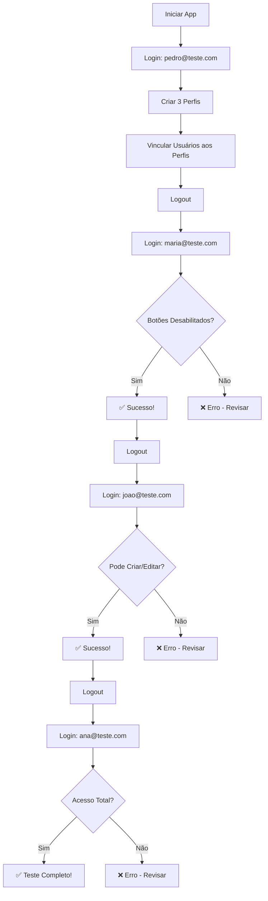

# 🔐 Como Fazer Login com os Usuários de Teste

**Data:** 14/10/2025

---

## 🎯 Método 1: Login via Teste Local

### **Passo a Passo Visual:**

```
┌─────────────────────────────────────────────────────────┐
│                  SGR - Sistema de Login                 │
├─────────────────────────────────────────────────────────┤
│                                                         │
│  🔵 Entrar com Azure AD                                │
│  ┌────────────────────────────────────────────────┐   │
│  │  Login com Microsoft EntraID                   │   │
│  │  (Usuários corporativos reais)                 │   │
│  └────────────────────────────────────────────────┘   │
│                                                         │
│  🧪 Teste Local ← CLICAR AQUI                          │
│  ┌────────────────────────────────────────────────┐   │
│  │  📧 Email: ___________________________         │   │
│  │                                                 │   │
│  │  Digite um dos emails abaixo:                  │   │
│  │  • pedro@teste.com                             │   │
│  │  • maria@teste.com                             │   │
│  │  • joao@teste.com                              │   │
│  │  • ana@teste.com                               │   │
│  │                                                 │   │
│  │          [Entrar]                              │   │
│  └────────────────────────────────────────────────┘   │
└─────────────────────────────────────────────────────────┘
```

---

## 👥 Usuários de Teste Disponíveis

### **1. Pedro Teste** 🧑‍💼
```
📧 Email: pedro@teste.com
👤 Nome: Pedro Teste
🎯 Sugestão de Uso: Testar "sem perfil" (access denied)
```

**Como usar:**
1. Na tela de login, clicar em **"Teste Local"**
2. Digitar: `pedro@teste.com`
3. Clicar em **"Entrar"**
4. Resultado: Acesso negado (se não vincular a perfil)

---

### **2. Maria Silva** 👩‍💼
```
📧 Email: maria@teste.com
👤 Nome: Maria Silva
🎯 Sugestão de Uso: Perfil "Visualizador" (apenas leitura)
```

**Como usar:**
1. Na tela de login, clicar em **"Teste Local"**
2. Digitar: `maria@teste.com`
3. Clicar em **"Entrar"**
4. Resultado: Vê tudo, mas botões desabilitados

**Setup recomendado:**
```
Perfil: Visualizador
Permissões: Apenas "Visualizar" em todos os módulos
Status: Ativo
```

---

### **3. João Santos** 🧑‍💼
```
📧 Email: joao@teste.com
👤 Nome: João Santos
🎯 Sugestão de Uso: Perfil "Gestor de Riscos" (operacional)
```

**Como usar:**
1. Na tela de login, clicar em **"Teste Local"**
2. Digitar: `joao@teste.com`
3. Clicar em **"Entrar"**
4. Resultado: Pode criar, editar, mas não excluir

**Setup recomendado:**
```
Perfil: Gestor de Riscos
Permissões: 
  - Identificação: Todas
  - Análise: Todas
  - Controles: View, Create, Edit (sem Delete)
Status: Ativo
```

---

### **4. Ana Costa** 👩‍💼
```
📧 Email: ana@teste.com
👤 Nome: Ana Costa
🎯 Sugestão de Uso: Perfil "Administrador" (acesso total)
```

**Como usar:**
1. Na tela de login, clicar em **"Teste Local"**
2. Digitar: `ana@teste.com`
3. Clicar em **"Entrar"**
4. Resultado: Acesso total, todos os botões habilitados

**Setup recomendado:**
```
Perfil: Administrador
Permissões: Todas em todos os módulos
Status: Ativo
```

---

## 🔄 Alternar Entre Usuários

### **Para Trocar de Usuário:**

```
1. Clicar no avatar (canto superior direito)
2. Clicar em "Sair"
3. Na tela de login, escolher "Teste Local"
4. Digitar outro email
5. Entrar
```

### **Atalho Rápido:**
```
Logout → pedro@teste.com → Testar "sem permissão"
Logout → maria@teste.com → Testar "apenas leitura"
Logout → joao@teste.com → Testar "operacional"
Logout → ana@teste.com → Testar "administrador"
```

---

## 🆚 Diferença: Azure AD vs Teste Local

### **🔵 Azure AD (Produção)**
```
✅ Usuários reais do Microsoft EntraID
✅ Autenticação corporativa
✅ Single Sign-On (SSO)
✅ Controle centralizado
✅ Para uso em produção
```

**Quando usar:**
- Ambiente de produção
- Usuários corporativos reais
- Integração com Microsoft 365

---

### **🧪 Teste Local (Desenvolvimento)**
```
✅ Usuários fictícios pré-cadastrados
✅ Sem necessidade de Azure AD configurado
✅ Perfeito para desenvolvimento local
✅ Múltiplos usuários para teste
✅ Apenas ambiente de desenvolvimento
```

**Quando usar:**
- Desenvolvimento local
- Testes de permissões
- Demonstrações
- QA/Homologação

---

## 🎭 Cenários de Teste

### **Cenário 1: Criar Perfis (usar Pedro)**
```bash
1. Login: pedro@teste.com
2. Ir para: /administration/access-profiles
3. Criar perfis:
   - Visualizador
   - Gestor de Riscos
   - Administrador
```

### **Cenário 2: Vincular Usuários (usar Pedro)**
```bash
1. Login: pedro@teste.com
2. Ir para: /administration/access-control
3. Vincular:
   - maria@teste.com → Visualizador
   - joao@teste.com → Gestor de Riscos
   - ana@teste.com → Administrador
```

### **Cenário 3: Testar Visualizador (usar Maria)**
```bash
1. Logout
2. Login: maria@teste.com
3. Ir para: /identification
4. Verificar: Botão "Novo Risco" desabilitado ❌
5. Ir para: /controls
6. Verificar: Botão "Novo Controle" desabilitado ❌
```

### **Cenário 4: Testar Gestor (usar João)**
```bash
1. Logout
2. Login: joao@teste.com
3. Ir para: /identification
4. Verificar: Botão "Novo Risco" habilitado ✅
5. Criar um risco de teste
6. Verificar: Consegue editar ✅
```

### **Cenário 5: Testar Admin (usar Ana)**
```bash
1. Logout
2. Login: ana@teste.com
3. Ir para: /administration
4. Verificar: Acesso a todas as páginas ✅
5. Verificar: Todos os botões habilitados ✅
```

---

## ⚠️ Importante!

### **🔒 Segurança:**
```
⚠️ Os usuários de teste APENAS funcionam em development!

if (process.env.NODE_ENV !== 'production') {
  // Teste Local habilitado
} else {
  // Teste Local DESABILITADO (apenas Azure AD)
}
```

### **🚀 Produção:**
```
Em produção, apenas Azure AD estará disponível.
Os usuários de teste NÃO aparecerão na tela de login.
```

---

## 🎯 Quick Reference

| Email | Nome | Perfil Sugerido | Caso de Uso |
|-------|------|-----------------|-------------|
| `pedro@teste.com` | Pedro Teste | Sem perfil | Testar access-denied |
| `maria@teste.com` | Maria Silva | Visualizador | Testar apenas leitura |
| `joao@teste.com` | João Santos | Gestor | Testar operacional |
| `ana@teste.com` | Ana Costa | Administrador | Testar acesso total |

---

## 📝 Comandos para Copiar

### **Login Maria:**
```
maria@teste.com
```

### **Login João:**
```
joao@teste.com
```

### **Login Ana:**
```
ana@teste.com
```

### **Login Pedro:**
```
pedro@teste.com
```

---

## 🔄 Fluxo Completo de Teste



---

## 🎉 Conclusão

Agora você tem **4 usuários de teste** prontos para validar todo o sistema ACL!

**Ordem recomendada de teste:**
1. 🧑‍💼 Pedro → Setup inicial (criar perfis)
2. 👩‍💼 Maria → Validar permissões limitadas
3. 🧑‍💼 João → Validar permissões operacionais
4. 👩‍💼 Ana → Validar acesso total

**Tempo estimado:** 15-20 minutos para teste completo

✅ **Sistema pronto para teste!**
