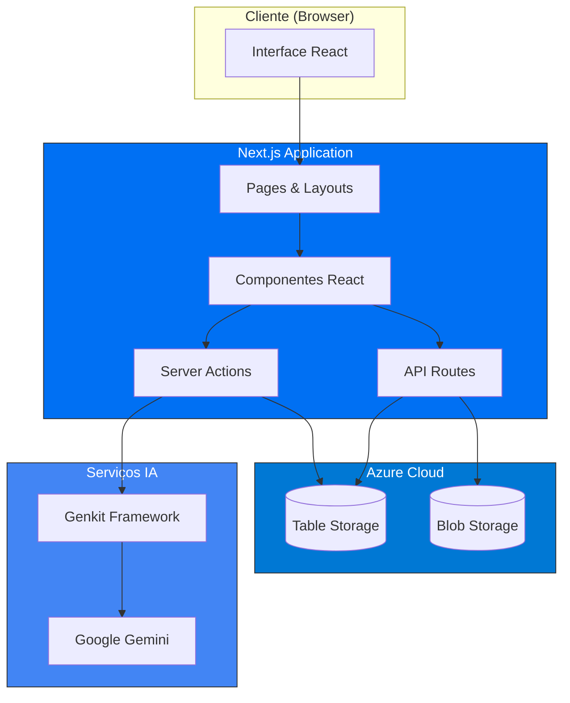
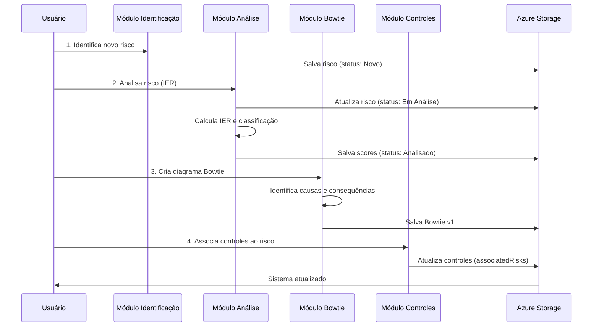
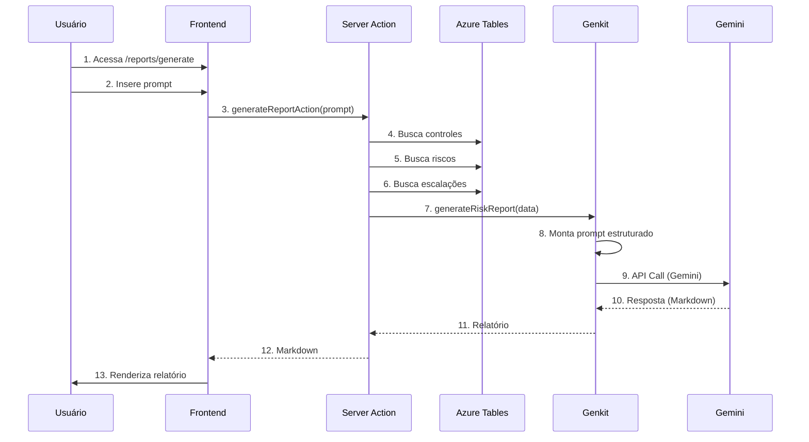
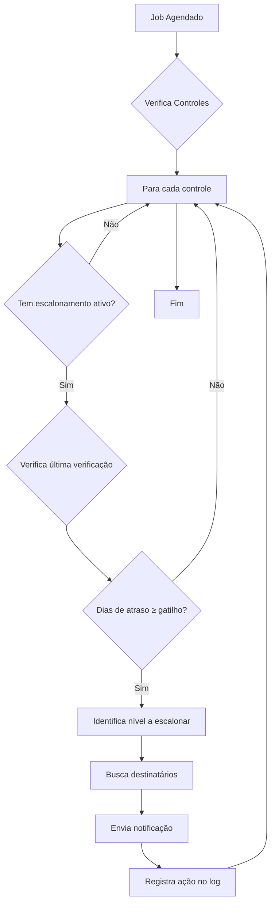
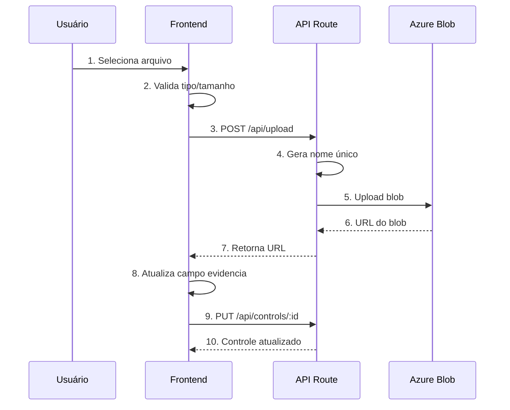
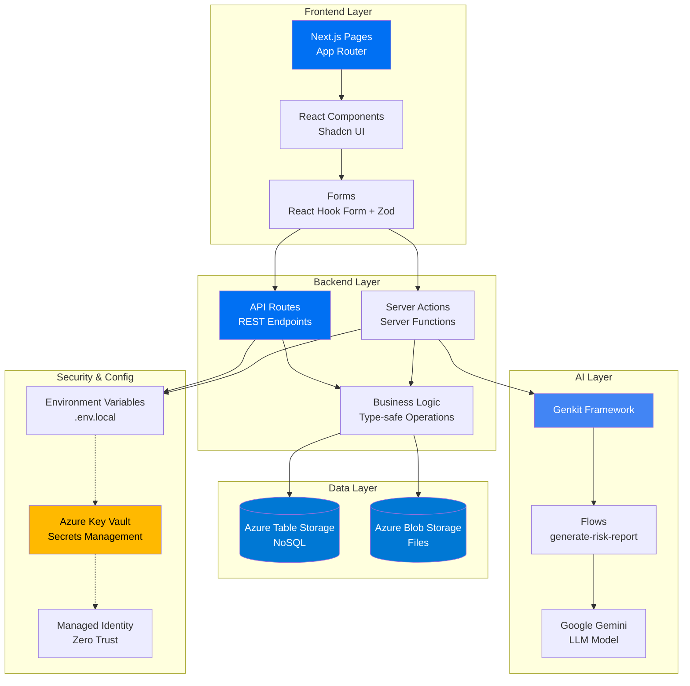

# SGR - Documentação Técnica Completa

**Sistema de Gestão de Riscos (SGR)**  
**Versão:** 0.1.0  
**Data:** Outubro 2025

---

## Índice

1. [Visão Geral](#visão-geral)
2. [Tecnologias Utilizadas](#tecnologias-utilizadas)
3. [Arquitetura da Aplicação](#arquitetura-da-aplicação)
4. [Armazenamento de Dados](#armazenamento-de-dados)
5. [Segurança](#segurança)
6. [Especificação Funcional](#especificação-funcional)
7. [Fluxos da Aplicação](#fluxos-da-aplicação)
8. [Implantação e Configuração](#implantação-e-configuração)
9. [Manutenção e Monitoramento](#manutenção-e-monitoramento)

---

## 1. Visão Geral

O **Sistema de Gestão de Riscos (SGR)** é uma aplicação web moderna desenvolvida para auxiliar organizações na identificação, análise, controle e monitoramento de riscos empresariais. O sistema oferece funcionalidades completas para:

- **Gestão de Riscos**: Identificação, análise e classificação de riscos usando metodologia IER (Índice de Exposição ao Risco)
- **Controles**: Cadastro e monitoramento de controles preventivos e corretivos
- **Análise Bowtie**: Visualização gráfica de causas, eventos e consequências de riscos
- **Escalonamento**: Configuração de regras de notificação baseadas em controles
- **KPIs**: Acompanhamento de indicadores de desempenho dos controles
- **Relatórios com IA**: Geração automatizada de relatórios analíticos usando Inteligência Artificial

O SGR foi projetado com foco em escalabilidade, segurança e usabilidade, utilizando tecnologias modernas de desenvolvimento web e serviços em nuvem Azure.

---

## 2. Tecnologias Utilizadas

### 2.1 Frontend

- **Next.js 15.5.4** (App Router): Framework React com renderização híbrida (SSR/SSG/CSR)
- **React 18.3.1**: Biblioteca para construção de interfaces de usuário
- **TypeScript 5**: Superset JavaScript com tipagem estática
- **Tailwind CSS 3.4.1**: Framework CSS utility-first para estilização
- **Shadcn UI / Radix UI**: Componentes acessíveis e customizáveis
  - Accordion, Dialog, Dropdown Menu, Select, Toast, Tooltip, etc.
- **Lucide React**: Biblioteca de ícones SVG
- **React Hook Form 7.54.2**: Gerenciamento de formulários performático
- **Zod 3.24.2**: Validação de schemas e tipos

### 2.2 Backend & APIs

- **Next.js API Routes**: Endpoints REST nativos do Next.js
- **Server Actions**: Funções server-side para operações sensíveis
- **Node.js 20+**: Runtime JavaScript no servidor

### 2.3 Armazenamento e Persistência

- **Azure Table Storage** (`@azure/data-tables 13.3.1`): Banco de dados NoSQL para entidades estruturadas
- **Azure Blob Storage** (`@azure/storage-blob 12.28.0`): Armazenamento de arquivos (evidências, documentos)

### 2.4 Inteligência Artificial

- **Genkit 1.14.1** (`genkit`, `@genkit-ai/next`, `genkit-cli`): Framework para criação de fluxos de IA
- **Google Gemini** (`@genkit-ai/googleai 1.14.1`): Modelo de linguagem para geração de relatórios

### 2.5 Bibliotecas Auxiliares

- **date-fns 3.6.0**: Manipulação de datas
- **uuid 13.0.0**: Geração de identificadores únicos
- **html2canvas 1.4.1**: Captura de screenshots de elementos HTML
- **jspdf 3.0.3**: Geração de PDFs no cliente
- **recharts 2.15.1**: Gráficos e visualizações de dados

### 2.6 Scripts e Desenvolvimento

```json
{
  "dev": "next dev --turbopack -p 9002",
  "genkit:dev": "genkit start -- tsx src/ai/dev.ts",
  "build": "next build",
  "start": "next start",
  "typecheck": "tsc --noEmit"
}
```

---

## 3. Arquitetura da Aplicação

### 3.1 Visão Geral da Arquitetura

O SGR segue uma arquitetura em camadas baseada no padrão **MVC adaptado para Next.js**, com separação clara entre frontend, backend e persistência:



### 3.2 Estrutura de Diretórios

```
src/
├── app/                          # Next.js App Router
│   ├── (app)/                   # Rotas da aplicação principal
│   │   ├── layout.tsx           # Layout compartilhado
│   │   ├── administration/      # Módulo de administração
│   │   ├── analysis/            # Análise de riscos
│   │   ├── bowtie/             # Diagramas Bowtie
│   │   ├── controls/           # Gestão de controles
│   │   ├── escalation/         # Escalonamento
│   │   ├── identification/     # Identificação de riscos
│   │   ├── improvement/        # Melhorias
│   │   └── reports/            # Relatórios IA
│   ├── api/                    # API Routes (REST)
│   │   ├── analysis/           # Endpoints de análise
│   │   ├── bowtie/             # CRUD Bowtie
│   │   ├── controls/           # CRUD Controles
│   │   ├── escalation/         # CRUD Escalonamento
│   │   ├── parameters/         # Parâmetros do sistema
│   │   └── ai/                 # Endpoints IA
│   ├── actions.ts              # Server Actions
│   ├── layout.tsx              # Root layout
│   └── page.tsx                # Home page
├── components/                  # Componentes React
│   ├── auth/                   # Autenticação
│   ├── bowtie/                 # Componentes Bowtie
│   ├── escalation/             # Componentes Escalonamento
│   ├── layout/                 # Layout (Header, Sidebar)
│   ├── report/                 # Geração de relatórios
│   └── ui/                     # Primitivos UI (Shadcn)
├── lib/                        # Bibliotecas e utilitários
│   ├── azure-table-storage.ts  # Cliente Azure Tables
│   ├── azure-blob-storage.ts   # Cliente Azure Blobs
│   ├── types.ts                # Definições TypeScript
│   ├── form-options.ts         # Opções de formulários
│   └── utils.ts                # Funções auxiliares
└── ai/                         # Fluxos de IA (Genkit)
    ├── genkit.ts               # Configuração Genkit
    ├── dev.ts                  # Dev server IA
    └── flows/
        └── generate-risk-report.ts  # Flow de relatórios
```

### 3.3 Camadas da Aplicação

#### **Camada de Apresentação (Frontend)**

- **Páginas e Layouts**: Implementadas com Next.js App Router, usando Server Components por padrão para melhor performance
- **Componentes Client**: Marcados com `"use client"` quando necessitam de interatividade ou hooks React
- **Formulários**: Gerenciados com `react-hook-form` + validação `zod`
- **Estado Global**: Uso de Context API para compartilhamento de estado (ex: `UserProvider`)

#### **Camada de Lógica de Negócio (Backend)**

- **API Routes**: Endpoints REST para operações CRUD
  - Padrão de nomenclatura: `GET`, `POST`, `PUT`, `DELETE`
  - Retornam `NextResponse` com JSON
- **Server Actions**: Funções assíncronas executadas no servidor
  - Marcadas com `"use server"`
  - Usadas para operações que requerem dados sensíveis ou lógica complexa
  - Exemplo: `generateReportAction` em `src/app/actions.ts`

#### **Camada de Persistência**

- **Azure Table Storage**: CRUD operations abstraídas em `src/lib/azure-table-storage.ts`
  - Funções: `getControls`, `createControl`, `updateControl`, `deleteControl`, etc.
  - Conversores: `controlToEntity`, `entityToControl` para serialização
- **Azure Blob Storage**: Upload/download de arquivos
  - Containers: `evidences`, `reports`, `documents`

#### **Camada de IA**

- **Genkit Flows**: Workflows estruturados para geração de conteúdo
  - Input schema (Zod): Define parâmetros de entrada
  - Prompt engineering: Instruções detalhadas para o modelo
  - Output: Markdown formatado com análise de riscos

---

## 4. Armazenamento de Dados

### 4.1 Azure Table Storage

O Azure Table Storage é um banco de dados NoSQL otimizado para grandes volumes de dados estruturados. Cada entidade possui:

- **PartitionKey**: Chave de particionamento (agrupa dados relacionados)
- **RowKey**: Chave única dentro da partição
- **Timestamp**: Data/hora de modificação (gerenciado automaticamente)

#### **Tabelas Principais**

| Tabela | PartitionKey | RowKey | Descrição |
|--------|--------------|--------|-----------|
| `controls` | `"Control"` | `id` (UUID) | Controles preventivos e corretivos |
| `riskanalysis` | `"Risk"` | `id` (UUID) | Riscos identificados e analisados |
| `bowties` | `riskId` | `${id}_v${version}` | Diagramas Bowtie versionados |
| `escalations` | `controlId` | `id` (UUID) | Configurações de escalonamento |
| `identifiedrisks` | `"IdentifiedRisk"` | `id` (UUID) | Riscos identificados (histórico) |
| `toprisks` | `"TopRisk"` | `id` (UUID) | Top Risks da organização |
| `kpis` | `"KPI"` | `id` (UUID) | Indicadores de desempenho |
| `parameters` | `type` (categoria) | `value` | Parâmetros configuráveis do sistema |

#### **Versionamento de Bowtie**

O sistema implementa versionamento para diagramas Bowtie:

```typescript
// Estrutura de chaves
PartitionKey = riskId        // Agrupa todas as versões de um risco
RowKey = `${id}_v${version}` // Identificador único da versão
```

**Exemplo:**
```
PartitionKey: "RISK-001"
RowKey: "bowtie-uuid-123_v1"
RowKey: "bowtie-uuid-123_v2"
RowKey: "bowtie-uuid-123_v3" (versão atual)
```

### 4.2 Azure Blob Storage

Armazenamento de arquivos binários organizados em containers:

- **`evidences`**: Evidências de controles (PDFs, imagens, documentos)
- **`reports`**: Relatórios gerados pela IA
- **`documents`**: Documentação geral do sistema

**Nomenclatura de blobs:**
```
{container}/{entityId}/{timestamp}_{filename}
Exemplo: evidences/CTRL-001/1696723200000_evidencia.pdf
```

### 4.3 Modelagem de Dados

#### **Control (Controle)**

```typescript
type Control = {
  id: string;                    // UUID
  nomeControle: string;          // Nome descritivo
  categoria: string;             // Inspeção, Procedimento, Checklist
  classificacao: string;         // Preventivo, Detectivo, Corretivo
  status: string;                // Ativo, Inativo, Em Revisão
  donoControle: string;          // Responsável
  emailDono: string;
  area: string;                  // Área organizacional
  dataUltimaVerificacao: Date;
  frequenciaMeses?: number;
  proximaVerificacao: Date;
  onePager: string;              // URL do documento
  evidencia: string;             // URL da evidência
  criticidade: string;           // Alta, Média, Baixa
  associatedRisks: AssociatedRisk[]; // Riscos mitigados
  criadoEm: Date;
  modificadoEm: string;
};
```

#### **Risk (Risco)**

```typescript
type Risk = {
  id: string;
  status: 'Novo' | 'Em Análise' | 'Analisado';
  risco: string;                 // Descrição
  topRiskAssociado: string;
  fatorDeRisco: string;
  categoria: string;
  taxonomia: string;
  
  // Scores para cálculo do IER
  imp: number;        // Impacto (1-5)
  org: number;        // Organização (1-5)
  prob: number;       // Probabilidade (1-5)
  ctrl: number;       // Controle (1-5)
  tempo: number;      // Tempo (1-5)
  facil: number;      // Facilidade (1-5)
  ier: number;        // Índice de Exposição ao Risco (calculado)
  
  tipoIER: 'Crítico' | 'Prioritário' | 'Gerenciável' | 'Aceitável';
  bowtieRealizado: 'Realizado' | 'Não Realizado' | 'Em Andamento';
  responsavelBowtie: string;
};
```

#### **Escalation (Escalonamento)**

```typescript
type EscalationConfig = {
  id: string;
  controlId: string;             // FK para Control
  controlName: string;
  isActive: boolean;
  levels: EscalationLevel[];     // Array de níveis
  createdAt: string;
  updatedAt: string;
  createdBy: string;
};

type EscalationLevel = {
  nivel: number;                 // 1, 2, 3...
  diasAtraso: number;            // Gatilho (dias)
  destinatarios: string[];       // Emails
  mensagem: string;
  acao: string;                  // Notificar, Escalar, Bloquear
};
```

### 4.4 Serialização e Conversão

Campos complexos (arrays, objetos) são serializados como JSON strings:

```typescript
// Ao salvar no Azure Table
const entity = {
  PartitionKey: "Control",
  RowKey: control.id,
  associatedRisks: JSON.stringify(control.associatedRisks),
  // ...outros campos primitivos
};

// Ao ler do Azure Table
const control: Control = {
  id: entity.RowKey,
  associatedRisks: JSON.parse(entity.associatedRisks as string),
  // ...outros campos
};
```

---

## 5. Segurança

### 5.1 Autenticação e Autorização

**Status Atual**: Implementação básica com Context API  
**Recomendações para Produção**:

1. **Azure Active Directory (Azure AD)**
   - Integração via `@azure/msal-react`
   - Single Sign-On (SSO) corporativo
   - Multi-Factor Authentication (MFA)

2. **NextAuth.js** (alternativa)
   - Suporte a múltiplos provedores
   - JWT tokens para sessões
   - Middleware para proteção de rotas

### 5.2 Gerenciamento de Secrets

**Configuração Atual**: Variáveis de ambiente em `.env.local`

```env
AZURE_STORAGE_CONNECTION_STRING=DefaultEndpointsProtocol=https;AccountName=...
GOOGLE_GENAI_API_KEY=AIzaSy...
NEXT_PUBLIC_BASE_URL=http://localhost:9002
```

**Recomendações para Produção**:

1. **Azure Key Vault**
   - Armazenamento centralizado de secrets
   - Rotação automática de chaves
   - Auditoria de acesso
   - Integração com Managed Identity

```typescript
// Exemplo de integração
import { SecretClient } from "@azure/keyvault-secrets";
import { DefaultAzureCredential } from "@azure/identity";

const credential = new DefaultAzureCredential();
const client = new SecretClient("https://<vault-name>.vault.azure.net", credential);
const secret = await client.getSecret("AZURE-STORAGE-CONNECTION-STRING");
```

2. **Managed Identity**
   - Elimina necessidade de connection strings
   - Autenticação automática entre serviços Azure

### 5.3 Segurança de APIs

#### **Proteção de Endpoints**

```typescript
// src/app/api/controls/route.ts
export async function GET(request: NextRequest) {
  // 1. Validar autenticação
  const session = await getServerSession();
  if (!session) {
    return NextResponse.json({ error: 'Unauthorized' }, { status: 401 });
  }
  
  // 2. Verificar permissões
  if (!hasPermission(session.user, 'controls:read')) {
    return NextResponse.json({ error: 'Forbidden' }, { status: 403 });
  }
  
  // 3. Executar operação
  const controls = await getControls();
  return NextResponse.json(controls);
}
```

#### **Validação de Input**

Todos os inputs são validados com schemas Zod:

```typescript
import { z } from 'zod';

const ControlSchema = z.object({
  nomeControle: z.string().min(3).max(200),
  categoria: z.enum(['Inspeção', 'Procedimento', 'Checklist']),
  donoControle: z.string().min(1),
  emailDono: z.string().email(),
  criticidade: z.enum(['Alta', 'Média', 'Baixa']),
});

export async function POST(request: NextRequest) {
  const body = await request.json();
  const validation = ControlSchema.safeParse(body);
  
  if (!validation.success) {
    return NextResponse.json(
      { error: validation.error.errors },
      { status: 400 }
    );
  }
  
  // Processar dados validados
  const control = await createControl(validation.data);
  return NextResponse.json(control);
}
```

### 5.4 Segurança de Dados

#### **Criptografia**

- **Em Trânsito**: TLS 1.2+ (HTTPS obrigatório)
- **Em Repouso**: Azure Storage Service Encryption (SSE) habilitado por padrão
- **Dados Sensíveis**: Considerar criptografia adicional no nível da aplicação

#### **Controle de Acesso (RBAC)**

Estrutura de roles implementada:

```typescript
type Role = 'admin' | 'moderator' | 'editor' | 'viewer';

const permissions = {
  admin: ['*'], // Todos os acessos
  moderator: ['controls:*', 'risks:*', 'escalation:*'],
  editor: ['controls:read', 'controls:write', 'risks:read', 'risks:write'],
  viewer: ['controls:read', 'risks:read'],
};
```

#### **Auditoria**

Todos os registros incluem campos de rastreabilidade:

- `criadoEm`: Data/hora de criação
- `criadoPor`: Usuário que criou
- `modificadoEm`: Data/hora da última modificação
- `modificadoPor`: Usuário que modificou

### 5.5 Segurança no Frontend

- **XSS Prevention**: React escapa automaticamente conteúdo
- **CSRF Protection**: Next.js implementa proteção em Server Actions
- **Content Security Policy (CSP)**: Recomendado configurar headers

```typescript
// next.config.ts
const nextConfig = {
  async headers() {
    return [
      {
        source: '/:path*',
        headers: [
          {
            key: 'Content-Security-Policy',
            value: "default-src 'self'; script-src 'self' 'unsafe-inline';"
          },
        ],
      },
    ];
  },
};
```

### 5.6 Checklist de Segurança para Produção

- [ ] Implementar autenticação robusta (Azure AD ou NextAuth)
- [ ] Migrar secrets para Azure Key Vault
- [ ] Habilitar Managed Identity para serviços Azure
- [ ] Configurar WAF (Web Application Firewall) no Azure Front Door
- [ ] Implementar rate limiting em APIs
- [ ] Configurar CORS adequadamente
- [ ] Habilitar logging e monitoramento (Application Insights)
- [ ] Realizar testes de penetração
- [ ] Implementar backup automático de dados
- [ ] Configurar alertas de segurança

---

## 6. Especificação Funcional

### 6.1 Módulos do Sistema

#### **6.1.1 Identificação de Riscos**

**Rota**: `/identification`

**Funcionalidades**:
- Cadastro de novos riscos com formulário estruturado
- Campos principais:
  - Descrição do risco
  - Gerência responsável
  - Categoria e taxonomia
  - Fator de risco associado
  - Top Risk relacionado
- Status inicial: "Novo"
- Listagem de riscos identificados com filtros
- Exportação para Excel/CSV

**Endpoints API**:
- `GET /api/identified-risks`: Lista riscos identificados
- `POST /api/identified-risks`: Cria novo risco
- `GET /api/identified-risks/:id`: Detalha risco específico
- `PUT /api/identified-risks/:id`: Atualiza risco
- `DELETE /api/identified-risks/:id`: Remove risco

#### **6.1.2 Análise de Riscos**

**Rota**: `/analysis`

**Funcionalidades**:
- Análise quantitativa de riscos usando metodologia IER
- Avaliação de 6 dimensões:
  1. **Impacto (IMP)**: Gravidade das consequências (1-5)
  2. **Organização (ORG)**: Capacidade de resposta (1-5)
  3. **Probabilidade (PROB)**: Chance de ocorrência (1-5)
  4. **Controle (CTRL)**: Eficácia dos controles (1-5)
  5. **Tempo (TEMPO)**: Janela de exposição (1-5)
  6. **Facilidade (FACIL)**: Facilidade de detecção (1-5)
- Cálculo automático do **IER** (Índice de Exposição ao Risco)
- Classificação automática:
  - **Crítico**: IER > 75
  - **Prioritário**: 50 < IER ≤ 75
  - **Gerenciável**: 25 < IER ≤ 50
  - **Aceitável**: IER ≤ 25
- Matriz de calor (heatmap) de riscos
- Posicionamento no mapa de riscos (eixos X/Y)

**Endpoints API**:
- `GET /api/analysis`: Lista riscos analisados
- `POST /api/analysis`: Cria análise de risco
- `PUT /api/analysis/:id`: Atualiza análise

#### **6.1.3 Gestão de Controles**

**Rota**: `/controls`

**Funcionalidades**:
- Cadastro de controles (preventivos, detectivos, corretivos)
- Categorias: Inspeção, Procedimento, Checklist
- Associação com riscos mitigados
- Agendamento de verificações periódicas
- Upload de evidências (OnePager, documentos)
- Criticidade (Alta, Média, Baixa)
- Gestão de KPIs por controle
- Dashboard de status dos controles
- Alertas de verificações pendentes

**Endpoints API**:
- `GET /api/controls`: Lista controles
- `POST /api/controls`: Cria controle
- `GET /api/controls/:id`: Detalha controle
- `PUT /api/controls/:id`: Atualiza controle
- `DELETE /api/controls/:id`: Remove controle

#### **6.1.4 Análise Bowtie**

**Rota**: `/bowtie`

**Funcionalidades**:
- Editor visual de diagramas Bowtie (gravata borboleta)
- Componentes do diagrama:
  - **Ameaças** (lado esquerdo): Causas do evento central
  - **Evento Central**: Risco materializado
  - **Consequências** (lado direito): Impactos resultantes
  - **Barreiras Preventivas**: Controles pré-evento
  - **Barreiras Mitigadoras**: Controles pós-evento
- Versionamento automático de diagramas
- Histórico de alterações
- Exportação para PDF e PNG
- Listagem exibe sempre a última versão por risco

**Endpoints API**:
- `GET /api/bowtie`: Lista Bowties (última versão)
- `POST /api/bowtie`: Cria novo Bowtie
- `GET /api/bowtie/:id`: Detalha Bowtie específico
- `PUT /api/bowtie/:id`: Atualiza Bowtie (cria nova versão)
- `GET /api/bowtie/:id/versions`: Lista todas as versões

**Lógica de Versionamento**:
```typescript
// Ao salvar uma nova versão
const latestVersion = await getLatestBowtieVersion(riskId);
const newVersion = latestVersion + 1;
const rowKey = `${bowtieId}_v${newVersion}`;

await createBowtieEntity({
  PartitionKey: riskId,
  RowKey: rowKey,
  version: newVersion,
  // ...dados do Bowtie
});
```

#### **6.1.5 Escalonamento**

**Rota**: `/escalation`

**Funcionalidades**:
- Configuração de regras de escalonamento por controle
- Níveis de escalonamento (1, 2, 3, etc.)
- Gatilhos baseados em dias de atraso
- Destinatários por nível (emails)
- Mensagens customizadas
- Ações: Notificar, Escalar, Bloquear
- Ativação/desativação de configurações
- Listagem de escalonamentos por controle
- Pré-seleção de controle ao configurar (via link da listagem)

**Endpoints API**:
- `GET /api/escalation`: Lista configurações
- `POST /api/escalation`: Cria configuração
- `GET /api/escalation/:id`: Detalha configuração
- `PUT /api/escalation/:id`: Atualiza configuração
- `DELETE /api/escalation/:id`: Remove configuração
- `GET /api/escalation/by-control/:controlId`: Busca por controle

**Fluxo de Uso**:
1. Usuário acessa listagem de controles
2. Clica em "Configurar Escalonamento" para um controle
3. Sistema abre formulário com controle pré-selecionado e bloqueado
4. Usuário define níveis, prazos e destinatários
5. Salva configuração
6. Sistema monitora atrasos e dispara notificações automaticamente

#### **6.1.6 Relatórios com IA**

**Rota**: `/reports/generate`

**Funcionalidades**:
- Geração automatizada de relatórios analíticos
- Input: Prompt do usuário + dados do sistema
- Processamento:
  1. Sistema coleta dados relevantes (controles, riscos, escalações, KPIs)
  2. Envia para flow Genkit com prompt estruturado
  3. Gemini gera análise em Markdown
- Exemplos de relatórios:
  - "Analise os controles críticos com verificações atrasadas"
  - "Faça um resumo dos riscos de alta prioridade e suas causas"
  - "Gere recomendações para melhorar a eficácia dos controles"
- Pré-visualização em tempo real
- Download em PDF
- Histórico de relatórios gerados

**Server Action**:
```typescript
// src/app/actions.ts
export async function generateReportAction(prompt: string) {
  "use server";
  
  // 1. Coletar dados do sistema
  const controls = await getControls();
  const risks = await getRisks();
  const escalations = await getEscalations();
  
  // 2. Chamar flow Genkit
  const report = await generateRiskReport({
    userPrompt: prompt,
    controls,
    risks,
    escalations,
  });
  
  // 3. Retornar Markdown
  return report;
}
```

**Flow Genkit**:
```typescript
// src/ai/flows/generate-risk-report.ts
export const generateRiskReport = ai.defineFlow(
  {
    name: 'generateRiskReport',
    inputSchema: z.object({
      userPrompt: z.string(),
      controls: z.array(z.any()),
      risks: z.array(z.any()),
      escalations: z.array(z.any()),
    }),
    outputSchema: z.string(),
  },
  async (input) => {
    const prompt = `
Você é um analista de riscos corporativos experiente. Analise os dados fornecidos e gere um relatório estruturado em Markdown.

DADOS DO SISTEMA:
- Controles: ${JSON.stringify(input.controls)}
- Riscos: ${JSON.stringify(input.risks)}
- Escalonamentos: ${JSON.stringify(input.escalations)}

SOLICITAÇÃO DO USUÁRIO: ${input.userPrompt}

FORMATO DE SAÍDA:
- Use Markdown com seções (##, ###)
- Inclua tabelas quando apropriado
- Destaque insights importantes em **negrito**
- Forneça recomendações acionáveis
`;

    const response = await ai.generate({
      model: gemini15Flash,
      prompt,
    });

    return response.text();
  }
);
```

#### **6.1.7 Administração de Parâmetros**

**Rota**: `/administration/parameters`

**Funcionalidades**:
- Gerenciamento de listas parametrizadas:
  - Fatores de Risco
  - Top Risks
  - Temas Materiais
  - Categorias de Controles
  - Taxonomias
- CRUD completo para cada tipo
- Uso em formulários (dropdowns, selects)

**Endpoints API**:
- `GET /api/parameters/:name`: Lista valores de um parâmetro
- `POST /api/parameters/:name`: Adiciona novo valor
- `DELETE /api/parameters/:name/:id`: Remove valor

### 6.2 Funcionalidades Transversais

#### **Busca e Filtros**

Todas as listagens suportam:
- Busca por texto (nome, descrição, ID)
- Filtros por categoria, status, responsável
- Ordenação por colunas
- Paginação (quando necessário)

#### **Exportação de Dados**

- Exportação de listagens para Excel/CSV
- Geração de PDFs de relatórios e diagramas
- Download de evidências e documentos

#### **Notificações**

- Toasts para confirmações e erros
- Alertas de verificações pendentes
- Notificações de escalonamento (futuro: email/webhook)

---

## 7. Fluxos da Aplicação

### 7.1 Fluxo Completo: Gestão de Risco



### 7.2 Fluxo: Geração de Relatório com IA



### 7.3 Fluxo: Escalonamento Automatizado



**Implementação Futura**:
- Azure Functions com Timer Trigger (CRON)
- Envio de emails via SendGrid ou Azure Communication Services
- Webhooks para integração com sistemas externos

### 7.4 Fluxo: Versionamento de Bowtie

```mermaid
flowchart LR
    A[Usuário edita Bowtie] --> B{Bowtie existe?}
    B -->|Não| C[Cria v1]
    B -->|Sim| D[Busca última versão]
    D --> E[Incrementa versão]
    E --> F[Salva nova entidade]
    F --> G[PartitionKey = riskId<br/>RowKey = id_v{n}]
    G --> H[Retorna sucesso]
    
    I[Usuário lista Bowties] --> J[Query por PartitionKey]
    J --> K[Agrupa por riskId]
    K --> L[Seleciona max version]
    L --> M[Retorna última versão]
```

### 7.5 Fluxo: Upload de Evidência



---

## 8. Implantação e Configuração

### 8.1 Pré-requisitos

- **Node.js**: v20+ (recomendado v22)
- **npm**: v10+
- **Conta Azure**: Com acesso a Storage Account
- **Google Cloud/AI Studio**: Para chave de API do Gemini
- **Git**: Para controle de versão

### 8.2 Configuração Local

#### **1. Clonar repositório**

```bash
git clone <url-do-repositorio>
cd SGR
```

#### **2. Instalar dependências**

```bash
npm install
```

#### **3. Configurar variáveis de ambiente**

Criar arquivo `.env.local` na raiz:

```env
# Azure Storage
AZURE_STORAGE_CONNECTION_STRING=DefaultEndpointsProtocol=https;AccountName=<account-name>;AccountKey=<key>;EndpointSuffix=core.windows.net

# Google Gemini
GOOGLE_GENAI_API_KEY=AIzaSy...

# Next.js
NEXT_PUBLIC_BASE_URL=http://localhost:9002
```

**Como obter as credenciais**:

- **Azure Storage**:
  1. Acesse [portal.azure.com](https://portal.azure.com)
  2. Crie/acesse um Storage Account
  3. Vá em "Access keys"
  4. Copie a Connection String

- **Google Gemini**:
  1. Acesse [ai.google.dev](https://ai.google.dev)
  2. Clique em "Get API Key"
  3. Crie um novo projeto ou use existente
  4. Gere e copie a chave

#### **4. Executar em desenvolvimento**

```bash
npm run dev
```

Aplicação disponível em: `http://localhost:9002`

#### **5. (Opcional) Executar Genkit Dev UI**

Para testar flows de IA localmente:

```bash
npm run genkit:dev
```

Dev UI disponível em: `http://localhost:4000`

### 8.3 Build de Produção

```bash
# Verificar tipos TypeScript
npm run typecheck

# Build otimizado
npm run build

# Executar produção
npm run start
```

### 8.4 Deploy no Azure

#### **Opção 1: Azure App Service**

1. **Criar App Service**:
```bash
az webapp create \
  --resource-group <rg-name> \
  --plan <plan-name> \
  --name <app-name> \
  --runtime "NODE:20-lts"
```

2. **Configurar variáveis de ambiente**:
```bash
az webapp config appsettings set \
  --resource-group <rg-name> \
  --name <app-name> \
  --settings \
    AZURE_STORAGE_CONNECTION_STRING="<connection-string>" \
    GOOGLE_GENAI_API_KEY="<api-key>"
```

3. **Deploy**:
```bash
# Via GitHub Actions (recomendado)
# ou
az webapp deployment source config-zip \
  --resource-group <rg-name> \
  --name <app-name> \
  --src dist.zip
```

#### **Opção 2: Azure Container Instances**

1. **Criar Dockerfile** (se não existir):
```dockerfile
FROM node:20-alpine
WORKDIR /app
COPY package*.json ./
RUN npm ci --only=production
COPY . .
RUN npm run build
EXPOSE 3000
CMD ["npm", "start"]
```

2. **Build e push**:
```bash
docker build -t sgr:latest .
docker tag sgr:latest <registry>.azurecr.io/sgr:latest
docker push <registry>.azurecr.io/sgr:latest
```

3. **Deploy container**:
```bash
az container create \
  --resource-group <rg-name> \
  --name sgr-container \
  --image <registry>.azurecr.io/sgr:latest \
  --cpu 2 --memory 4 \
  --ports 3000 \
  --environment-variables \
    AZURE_STORAGE_CONNECTION_STRING="<connection-string>" \
    GOOGLE_GENAI_API_KEY="<api-key>"
```

### 8.5 Inicialização das Tabelas

O sistema cria as tabelas automaticamente na primeira execução. Para forçar criação:

```typescript
// Executar script de inicialização
import { TableServiceClient } from "@azure/data-tables";

const tableService = TableServiceClient.fromConnectionString(
  process.env.AZURE_STORAGE_CONNECTION_STRING!
);

const tables = [
  'controls',
  'riskanalysis',
  'bowties',
  'escalations',
  'identifiedrisks',
  'toprisks',
  'kpis',
  'parameters'
];

for (const tableName of tables) {
  await tableService.createTable(tableName);
  console.log(`Tabela ${tableName} criada`);
}
```

### 8.6 Monitoramento e Logs

**Azure Application Insights** (recomendado):

```bash
# Adicionar pacote
npm install applicationinsights

# Configurar no código
import * as appInsights from 'applicationinsights';
appInsights.setup(process.env.APPINSIGHTS_CONNECTION_STRING).start();
```

**Logs em desenvolvimento**:
```bash
# Logs do Next.js
npm run dev

# Logs do Genkit
npm run genkit:dev
```

---

## 9. Manutenção e Monitoramento

### 9.1 Backups

**Azure Table Storage**:
- Habilitar soft delete (recuperação de 7-90 dias)
- Configurar backups periódicos com Azure Backup

```bash
# Exemplo de backup manual
az storage table policy create \
  --table-name controls \
  --name backup-policy \
  --permission r \
  --expiry 2025-12-31
```

**Azure Blob Storage**:
- Lifecycle management para arquivar blobs antigos
- Replicação geo-redundante (GRS)

### 9.2 Monitoramento de Performance

**Métricas importantes**:
- Tempo de resposta das APIs
- Taxa de sucesso/erro de requisições
- Uso de memória e CPU
- Latência do Azure Storage
- Chamadas ao Gemini (custo e latência)

**Alertas recomendados**:
- Erro 5xx > 1% em 5 minutos
- Tempo de resposta > 2s (P95)
- Falhas de autenticação > 10 em 1 minuto

### 9.3 Atualizações de Dependências

```bash
# Verificar pacotes desatualizados
npm outdated

# Atualizar pacotes (cuidado com breaking changes)
npm update

# Atualizar Next.js
npm install next@latest react@latest react-dom@latest

# Executar testes após atualizações
npm run typecheck
npm run build
```

### 9.4 Troubleshooting Comum

| Problema | Causa Provável | Solução |
|----------|----------------|---------|
| Erro "Table not found" | Tabela não criada | Executar script de inicialização |
| 401 Unauthorized no Azure | Connection string inválida | Verificar `.env.local` |
| Erro no Gemini | API Key incorreta ou quota excedida | Verificar chave e billing no Google Cloud |
| Build falha | Erros de tipo TypeScript | Executar `npm run typecheck` e corrigir |
| Upload de arquivo falha | Tamanho excede limite | Verificar `next.config.ts` (max 50MB) |

---

## Diagrama de Arquitetura Geral



---

## Conclusão

O **Sistema de Gestão de Riscos (SGR)** é uma solução completa e moderna para gestão de riscos corporativos, construída com as melhores práticas de desenvolvimento web e cloud computing. Sua arquitetura escalável, segurança robusta e funcionalidades avançadas (incluindo IA) o tornam uma ferramenta poderosa para organizações de todos os tamanhos.

**Próximos passos recomendados**:
1. Implementar autenticação empresarial (Azure AD)
2. Migrar secrets para Azure Key Vault
3. Configurar CI/CD com GitHub Actions
4. Adicionar testes automatizados (unit, integration, e2e)
5. Implementar funcionalidade de escalonamento automatizado
6. Desenvolver dashboards executivos com KPIs agregados

---

**Contato**: Para suporte técnico ou dúvidas sobre a implementação, consulte a equipe de engenharia responsável pelo projeto.

**Versão do documento**: 1.0  
**Última atualização**: Outubro 2025
